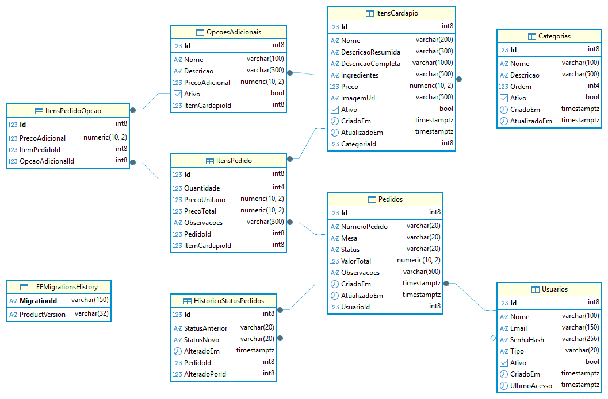

# 🥐 Padoka - Sistema de Pedidos para Padaria

<div align="center">


**Sistema web completo para gerenciamento de pedidos da Panificadora e Padaria Padoka**

[Sobre](#-sobre-o-projeto) •
[Funcionalidades](#-funcionalidades) •
[Tecnologias](#️-tecnologias) •
[Instalação](#-instalação) •
[API](#-documentação-da-api) •
[Banco de Dados](#-banco-de-dados)

</div>

---

## 📖 Sobre o Projeto

A **Panificadora e Padaria Padoka** está situada estrategicamente na região central da cidade de **Barretos, interior de São Paulo**. Considerada um verdadeiro patrimônio da cidade, integra-se diariamente à rotina e à cultura dos moradores barretenses.

### 🏪 O Estabelecimento

O contexto operacional da Padoka caracteriza-se por oferecer um ambiente físico que une **conforto e funcionalidade**, idealizado para fomentar a convivência social, seja em encontros familiares ou breves reuniões de negócios.

**Diferenciais competitivos:**
- 🍰 **Confeitaria própria** com receitas exclusivas
- 🥖 **Mix diversificado** de produtos: panificação tradicional, confeitaria fina, petit fours, lanches naturais e linha completa de cafés
- ☕ **Coffee Breaks** personalizados para eventos corporativos e sociais
- 📍 **Localização privilegiada** no centro de Barretos

### 📋 Cardápio Físico

<div align="center">


*Cardápio físico da Padaria Padoka com a variedade de produtos oferecidos*
</div>

---

## ✨ Funcionalidades

### 👤 Módulo Cliente

| Código | Funcionalidade | Descrição |
|--------|---------------|-----------|
| **RF001** | Visualizar Cardápio | Cardápio completo organizado por categorias (bebidas, lanches, doces, etc.) com navegação SPA |
| **RF002** | Detalhes do Item | Visualização detalhada com nome, descrição, ingredientes, preço e opções adicionais |
| **RF003** | Adicionar ao Pedido | Sistema de carrinho com persistência durante navegação e feedback visual |
| **RF004** | Revisar e Enviar Pedido | Revisão completa do pedido com ajuste de quantidades e confirmação |

### 🔐 Módulo Administração

| Código | Funcionalidade | Descrição |
|--------|---------------|-----------|
| **RF005** | Login de Administrador | Autenticação segura via JWT com controle de sessão |
| **RF006** | Gerenciar Cardápio | CRUD completo de itens e categorias do cardápio |
| **RF007** | Visualizar Pedidos | Lista de pedidos com filtros por status e notificações |
| **RF008** | Atualizar Status | Gestão do fluxo de pedidos (Recebido → Em Preparo → Pronto → Entregue) |

---

## 🛠️ Tecnologias

### Backend
- **ASP.NET Core 8.0** - Framework web moderno e performático
- **Entity Framework Core** - ORM para acesso a dados
- **PostgreSQL** - Banco de dados relacional robusto
- **JWT (JSON Web Tokens)** - Autenticação stateless segura
- **Swagger/OpenAPI** - Documentação interativa da API

### Frontend
- **Razor Views** - Engine de templates do ASP.NET
- **Bootstrap 5.3** - Framework CSS responsivo
- **jQuery** - Manipulação DOM e requisições AJAX
- **Font Awesome** - Biblioteca de ícones

### Arquitetura
```
┌─────────────────────────────────────────────────────────────┐
│                      CLIENTE (Browser)                       │
│  ┌─────────────┐  ┌─────────────┐  ┌─────────────────────┐  │
│  │  Cardápio   │  │  Checkout   │  │   Admin Dashboard   │  │
│  │   (SPA)     │  │   (Cart)    │  │    (Gestão)         │  │
│  └─────────────┘  └─────────────┘  └─────────────────────┘  │
└─────────────────────────────────────────────────────────────┘
                              │
                              ▼
┌─────────────────────────────────────────────────────────────┐
│                    ASP.NET Core API                          │
│  ┌──────────┐  ┌──────────┐  ┌──────────┐  ┌──────────────┐ │
│  │   Auth   │  │ Cardápio │  │ Pedidos  │  │    Admin     │ │
│  │Controller│  │Controller│  │Controller│  │  Controller  │ │
│  └──────────┘  └──────────┘  └──────────┘  └──────────────┘ │
│                              │                               │
│  ┌───────────────────────────────────────────────────────┐  │
│  │                    Services Layer                      │  │
│  └───────────────────────────────────────────────────────┘  │
│                              │                               │
│  ┌───────────────────────────────────────────────────────┐  │
│  │              Entity Framework Core (ORM)               │  │
│  └───────────────────────────────────────────────────────┘  │
└─────────────────────────────────────────────────────────────┘
                              │
                              ▼
┌─────────────────────────────────────────────────────────────┐
│                      PostgreSQL Database                     │
│  ┌──────────┐  ┌──────────┐  ┌──────────┐  ┌──────────────┐ │
│  │ Usuarios │  │Categorias│  │  Itens   │  │   Pedidos    │ │
│  └──────────┘  └──────────┘  │ Cardápio │  └──────────────┘ │
│                              └──────────┘                    │
└─────────────────────────────────────────────────────────────┘
```

---

## 🗄️ Banco de Dados

### Modelo Entidade-Relacionamento (MER)

<div align="center">


*Diagrama do Modelo Entidade-Relacionamento do sistema Padoka*
</div>

### Entidades Principais

| Entidade | Descrição |
|----------|-----------|
| **Usuarios** | Usuários do sistema (clientes e administradores) |
| **Categorias** | Categorias do cardápio (Bebidas, Lanches, Doces, etc.) |
| **ItensCardapio** | Produtos disponíveis para venda |
| **OpcoesAdicionais** | Complementos opcionais para os itens |
| **Pedidos** | Pedidos realizados pelos clientes |
| **ItensPedido** | Itens que compõem cada pedido |
| **ItensPedidoOpcao** | Opções adicionais selecionadas em cada item |
| **HistoricoStatusPedido** | Registro de alterações de status dos pedidos |

---

## 🚀 Instalação

### Pré-requisitos

- [.NET 8.0 SDK](https://dotnet.microsoft.com/download/dotnet/8.0)
- [PostgreSQL 14+](https://www.postgresql.org/download/)
- [Git](https://git-scm.com/)

### Passo a Passo

1. **Clone o repositório**
```bash
git clone https://github.com/gabrielsimoest/Padoka.git
cd Padoka
```

2. **Configure o banco de dados**

Edite o arquivo `appsettings.json` com suas credenciais do PostgreSQL:
```json
{
  "ConnectionStrings": {
    "DefaultConnection": "Host=localhost;Database=padoka_db;Username=seu_usuario;Password=sua_senha"
  }
}
```

3. **Execute as migrations**
```bash
dotnet ef database update
```

4. **Popular o cardápio (opcional)**
```bash
# Execute o script SQL para popular o cardápio
psql -U seu_usuario -d padoka_db -f Scripts/PopularCardapio.sql
```

5. **Execute a aplicação**
```bash
dotnet run
```

6. **Acesse o sistema**
- 🌐 **Aplicação:** http://localhost:5000
- 📚 **Swagger:** http://localhost:5000/swagger

---

## 📚 Documentação da API

A API está documentada utilizando **Swagger/OpenAPI**. Após iniciar a aplicação, acesse:

```
http://localhost:5000/swagger
```

### Principais Endpoints

#### 🔐 Autenticação
| Método | Endpoint | Descrição |
|--------|----------|-----------|
| POST | `/api/auth/login` | Autenticar usuário |
| POST | `/api/auth/registro` | Registrar novo usuário |
| POST | `/api/auth/logout` | Encerrar sessão |

#### 📋 Cardápio
| Método | Endpoint | Descrição |
|--------|----------|-----------|
| GET | `/api/cardapio` | Listar todas as categorias e itens |
| GET | `/api/cardapio/categorias` | Listar categorias |
| GET | `/api/cardapio/itens/{id}` | Detalhes de um item |

#### 🛒 Pedidos
| Método | Endpoint | Descrição |
|--------|----------|-----------|
| POST | `/api/pedidos` | Criar novo pedido |
| GET | `/api/pedidos/{id}` | Consultar pedido |
| GET | `/api/pedidos/meus-pedidos` | Listar pedidos do usuário |

#### ⚙️ Administração (requer autenticação)
| Método | Endpoint | Descrição |
|--------|----------|-----------|
| GET | `/api/admin/pedidos` | Listar todos os pedidos |
| PUT | `/api/admin/pedidos/{id}/status` | Atualizar status do pedido |
| POST | `/api/admin/categorias` | Criar categoria |
| POST | `/api/admin/itens` | Criar item do cardápio |
| PUT | `/api/admin/itens/{id}` | Atualizar item |
| DELETE | `/api/admin/itens/{id}` | Excluir/desativar item |

---

## 📁 Estrutura do Projeto

```
Padoka/
├── 📂 Controllers/          # Controladores MVC e API
│   ├── AdminController.cs
│   ├── AuthController.cs
│   ├── CardapioController.cs
│   ├── HomeController.cs
│   └── PedidoController.cs
├── 📂 DTOs/                 # Data Transfer Objects
├── 📂 Infraestrutura/       # Configuração e DbContext
│   ├── DependencyInjection.cs
│   └── PadokaContext.cs
├── 📂 Models/               # Entidades do domínio
│   ├── Categoria.cs
│   ├── ItemCardapio.cs
│   ├── Pedido.cs
│   └── Usuario.cs
├── 📂 Services/             # Lógica de negócio
├── 📂 Views/                # Views Razor
│   ├── Admin/
│   ├── Auth/
│   ├── Cardapio/
│   ├── Pedido/
│   └── Shared/
├── 📂 wwwroot/              # Arquivos estáticos
│   ├── css/
│   ├── js/
│   └── img/
├── 📂 Scripts/              # Scripts SQL
│   └── PopularCardapio.sql
├── appsettings.json         # Configurações
├── Program.cs               # Entry point
└── Padoka.csproj           # Arquivo do projeto
```

---

## 🔒 Segurança

- **Autenticação JWT** com tokens de curta duração
- **Senhas hasheadas** com BCrypt
- **Autorização baseada em roles** (Cliente/Administrador)
- **Proteção CSRF** em formulários
- **Validação de entrada** em todos os endpoints

---

## 👥 Tipos de Usuário

| Tipo | Permissões |
|------|------------|
| **Cliente** | Visualizar cardápio, fazer pedidos, acompanhar status |
| **Administrador** | Todas as permissões + gerenciar cardápio e pedidos |

---

## 📱 Responsividade

O sistema é totalmente responsivo, adaptando-se a diferentes tamanhos de tela:

- 📱 **Mobile** (< 576px)
- 📱 **Tablet** (576px - 991px)
- 💻 **Desktop** (> 991px)

---

## 🤝 Contribuição

1. Faça um fork do projeto
2. Crie uma branch para sua feature (`git checkout -b feature/NovaFeature`)
3. Commit suas mudanças (`git commit -m 'Add: nova feature'`)
4. Push para a branch (`git push origin feature/NovaFeature`)
5. Abra um Pull Request

---

## 📄 Licença

Este projeto foi desenvolvido para fins acadêmicos.

---

## 📞 Contato

**Padaria Padoka** - Barretos, SP

---

<div align="center">

Desenvolvido com ❤️ para a **Panificadora e Padaria Padoka**

*"Um verdadeiro patrimônio de Barretos"*

</div>
